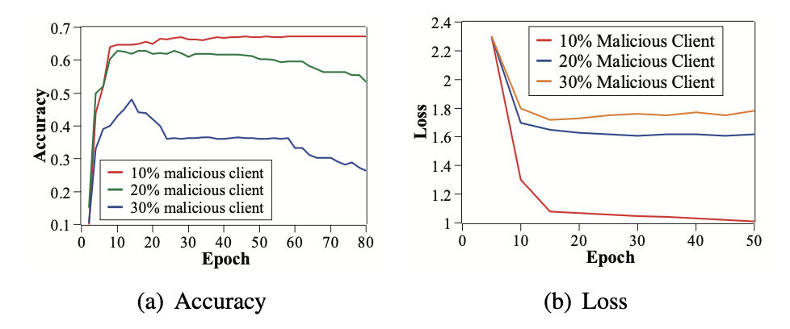
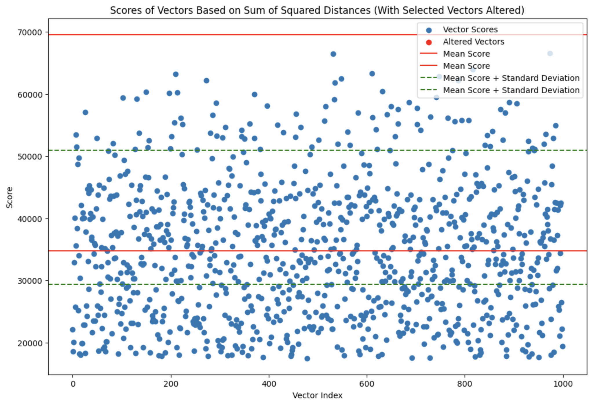
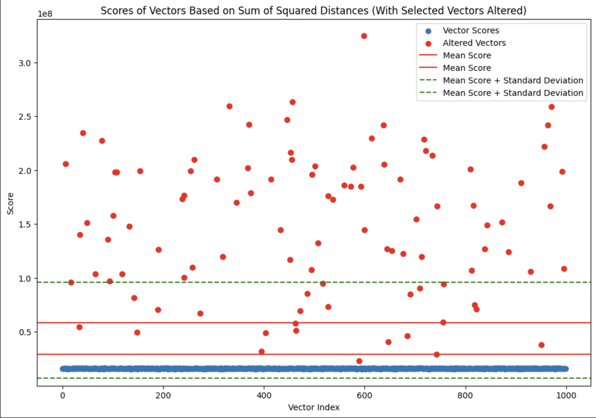
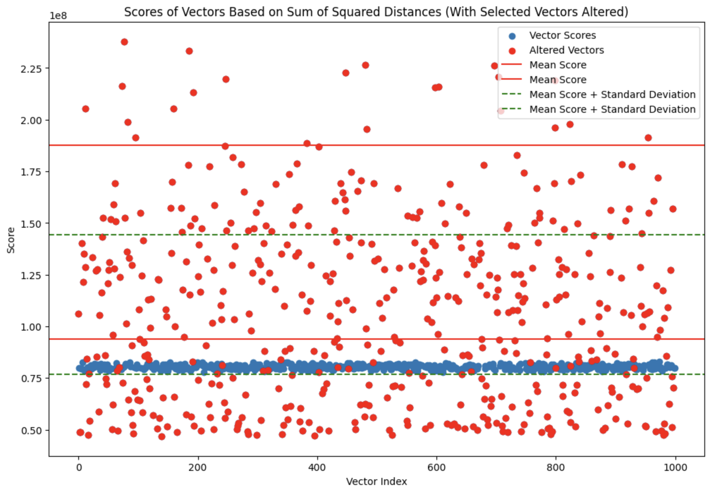

# zk-Krum
Implemented the Krum algorithm in noir to generate zk proof of Byzantine Tolerance

### Federated Learning
FL is machine learning scheme where a central server sends a set of base model parameters to a bunch of clinets. These clients have access to local data set on which they train this model and send the updated model parameters back to the server. The server then takes an average of all these updated models and sends it back to the clients as the base model for the next epoch.

### Byzantine Tolerance
A problem with this scheme is that a set of malicious clients can return random parameters that can skew the average and reduce accuracy of the model. 
   </img>  
In order to resolve that we need to identify malicous parameters and remove them. We can use the [Krum function](https://proceedings.neurips.cc/paper_files/paper/2017/file/f4b9ec30ad9f68f89b29639786cb62ef-Paper.pdf) here to do that.

### FL network on Blockchain
We can deploy this scheme on a trust network like [EigenLayer](https://www.eigenlayer.xyz/) where the clients would have to stake an amount which can get slashed on malicous behaviour. In this setup the slashing conditions must be verifiable on chain so that slashing is always done in a fair and transparent manner. The problem is that performing the Krum function on chain would be impractical due to gas costs. 
  
In order to solve this issue, the server, before aggregation, can run the Krum function and generate a zk proof of the computation. If there are any malicious clients, it can submit the proof on chain and call for slashing. If there are no bad actors, it should generate a proof of that so that no slashing condition is called for that epoch. 

### Krum Function
It works by calculating the euclidian distances between all vectors and doing the summation to assign a score to each vector. The assumption is that the number of non malicous actors are the majority in the network. In this scenario, the score of majority of vectors would be small since they would be bunched together and the malicous vectors would be outliers. 
  
We need to define what threshold condition to use to segerate bad actors from honest nodes. This approach calculates the number of vectors in lower bracket (mean to mean - 0.5 * std) and number of vectors in upper brakcet (mean to mean + 1.5 * std). If there are more vectors in lower bracket then there must exist at least one malicious vector. 
  
</img>
</img>
 
This threshold scheme would fail in a cybil attack when 51% nodes are malicous.
  
</img>

### References

I have explored how Federated Learnig can be implemented on EigenLayer in detail [here](https://docs.google.com/document/d/1AWa8TTtIeR_mOKcSERe54G-BcIy_uEKcEIKtiAZ267s/edit).
